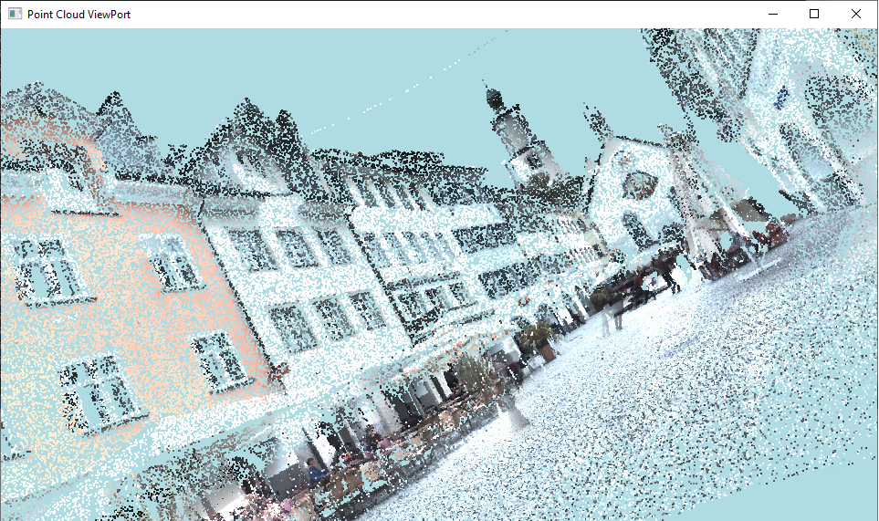

# Basic Point Cloud Viewer

## Purpose.

The main purpose of this personal project was to provide an educational and skill challenge in C++, to myself.

## References.

The Point Cloud dataset shown in the images, was provided in the website: [Semantic 3D](https://semantic3d.net)

## This Project.

A basic point cloud viewer, made with C++11 and powered by modern OpenGL, is capable of loading and generate a visualization from small to large point cloud datasets, also is able to highlight points with colors (RGB).

## What was used.

This project used:

* C++11: Base programming language.
* Modern OpengGL: Base graphics rendering API.
* GLSL 330 Core: Version 330 of OpenGL Shading Language.
* GLEW: Wrapper.
* GLFW: Window context and input provider.
* GLM: OpenGL Mathematics, usefull for transformations and matrix manipulation.

## How to use.

- A normalized dataset containing x,y,z coordinates is required and if desirable, colors in r,g,b format and it's intensities if possible, between float numbers [-1,1].

- You must indicate the path with filename of the input file in the Dataset_Utils.cpp file, after it just compile.

- For now only rotation around the generated point cloud is supported, by pressing in the keyboard the keys 'A', 'D', 'W', 'S', 'Q' and 'E'.

- Reset to the initial view, by pressing 'T'.

## TODO List

- [ ] Implement variable zoom.
- [ ] Implement free camera movement.
- [ ] Intensity reader.
- [ ] Abstraction into classes.
- [ ] Implement built-in dataset normalizator.
- [ ] Camera with movement driven by mouse.
- [ ] Grid in the canvas.
- [ ] User friendly data input UI.
- [ ] Implement viewport [imgui](https://github.com/ocornut/imgui) interface.

